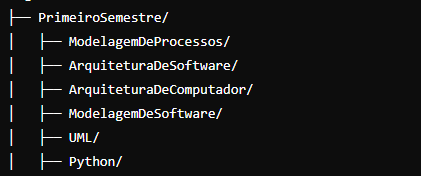
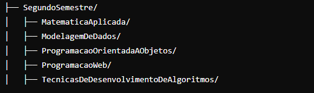

# Minha Graduação em Engenharia de Software - Lista de Exercícios Práticos de Cada Módulo

## Lista de Recursos Para as Práticas
## IDEs e outros
 - [VSCode](https://code.visualstudio.com)
 - [Cursor](https://www.cursor.com)
 - [SublimeText](https://www.sublimetext.com)
 - Bloco de Notas
 - Meu caderno
 ## Plataformas de Treinamento
- [Leetcode](https://leetcode.com)
- [Beecrowd](https://www.beecrowd.com.br)

## Github
- [Meu Github](https://github.com/HenriqueSoftwareEngineer)

## Organização das pastas
### Primeiro semestre

### Segundo semestre

## Linguagens de Programação Utilizadas 

### Java Script

### Python

### C++

### HTML e CSS (Front End)

## Frameworks

### React
### React Native
